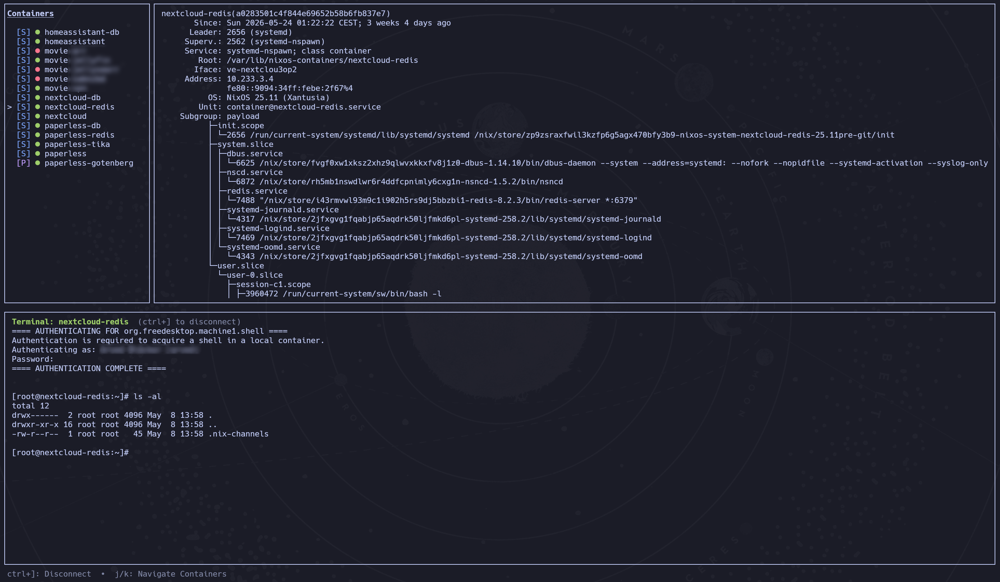

# parallax

A terminal UI for managing containers across multiple runtimes.



## Features

- Lists containers from **systemd-nspawn**, **Podman** (systemd-managed via `virtualisation.oci-containers`), and **Docker** in a single view
- Start and stop containers with `s`
- Open an interactive shell inside any running container with `Enter`
- Live status detail pane — shows `machinectl status`, `podman inspect`, or `docker inspect` output for the selected container
- Automatic refresh every second
- Scales to any terminal size

## Container runtimes

| Badge | Runtime          | Detection method            |
| ----- | ---------------- | --------------------------- |
| `[S]` | systemd-nspawn   | `container@*.service` units |
| `[P]` | Podman (systemd) | `podman-*.service` units    |
| `[D]` | Docker           | `docker ps`                 |

## Installation

### NixOS

Add to your flake inputs:

```nix
inputs.parallax.url = "git+https://codeberg.org/blckr/parallax";
```

Then add to `environment.systemPackages`:

```nix
inputs.parallax.packages.${system}.default
```

### Run without installing

```sh
nix run git+https://codeberg.org/blckr/parallax
```

### Temporary install (current shell only)

```sh
nix shell git+https://codeberg.org/blckr/parallax
```
